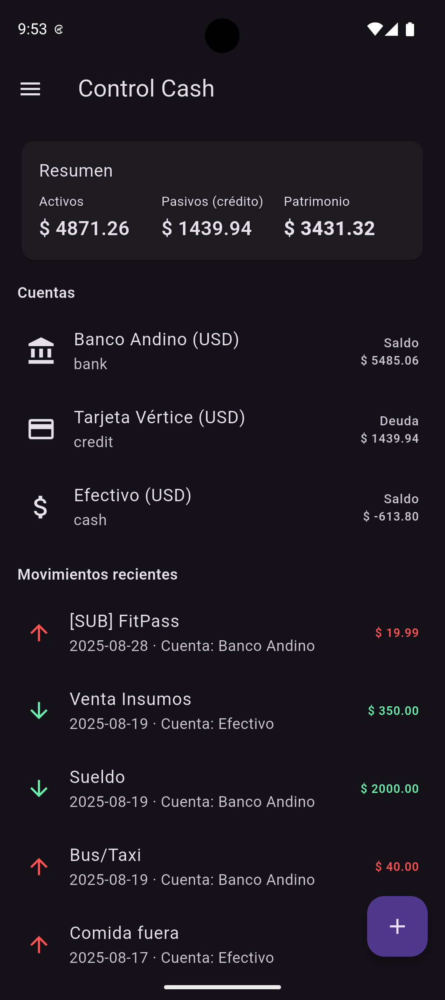
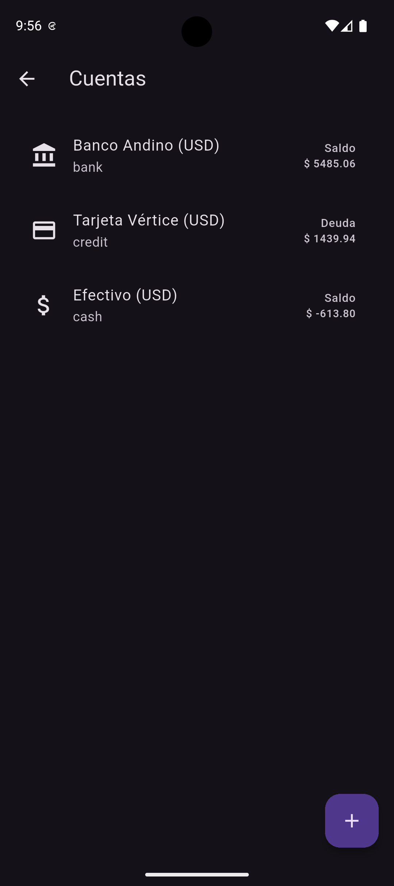
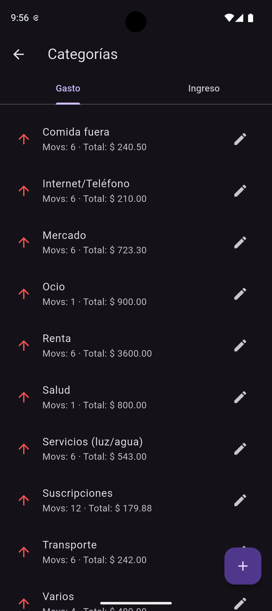
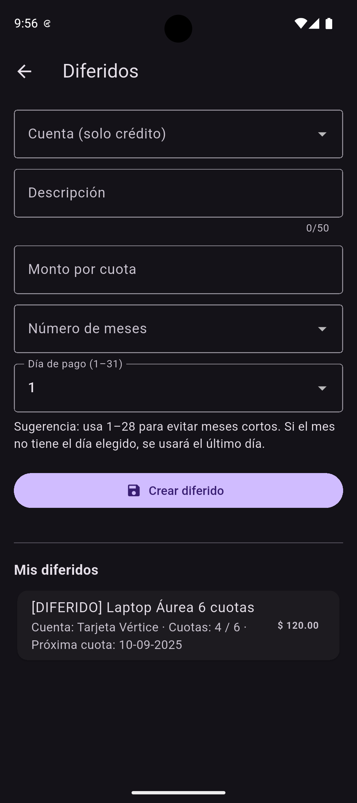
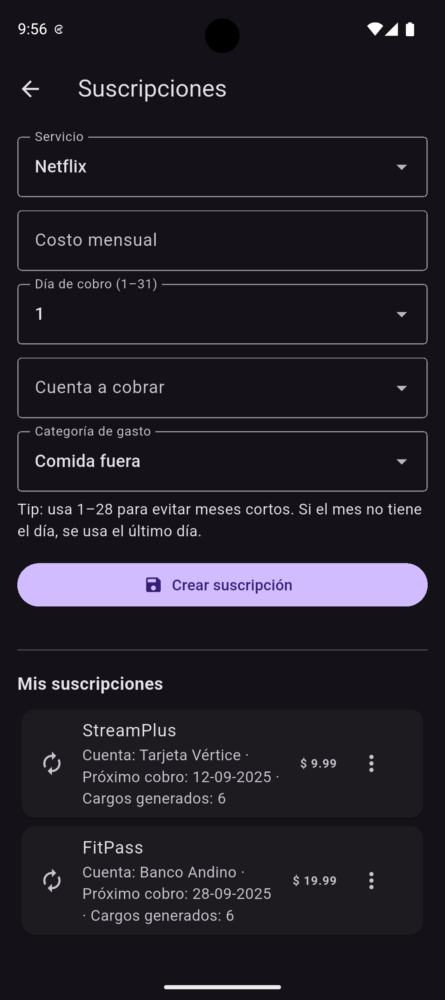
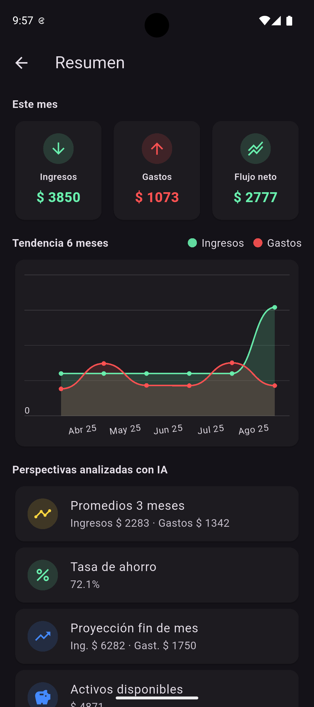
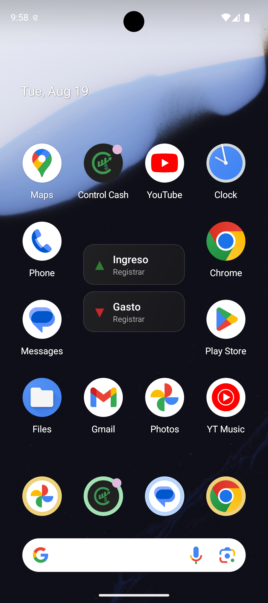

# 💸 Control Cash (Balancio) - Showcase

**Control Cash** is a mobile app for **personal finance management**, designed to help users easily track their money, manage multiple accounts, and stay in control of their balance.  

> 📱 **Status:** Coming soon on **Google Play Store**  
> 🚀 This repo is a **showcase only** – it includes screenshots, features, and technical details of the app.

---

## ✨ Features
- Register **income** and **expenses** quickly with categories.  
- **Multiple accounts**: cash, bank, credit card, etc.  
- **Transfers** between accounts without altering the global balance.  
- **Subscriptions** and recurring payments (salary, Netflix, gym, etc.).  
- **Deferred payments** and installment tracking.  
- **Charts & summaries** for a clear monthly view.  
- **Smart reminders** and balance alerts.  
- **Dark mode** with a modern, minimal design.  

---

## 📸 Screenshots

  
  
  

  
  
  

  

---

## 🛠️ Tech Stack
- **Flutter / Dart**  
- **Hive** (local persistence)  
- **Google Mobile Ads** (banner ads)  
- **Local notifications** (reminders & alerts)  
- Android (primary target), iOS optional  

---

## 🚀 Publication
- 📦 Will be released on **Google Play Store**.  
- A direct link will be added here once the app is published.  

---

## 📌 Roadmap
- [ ] CSV/Excel export of transactions  
- [ ] Advanced filters and tags  
- [ ] Improved widget with quick actions  
- [ ] Multi-language support (EN/ES)  

---

## 👤 Author
**Felipe Quirola**  
- 📍 Computer Science Engineering Student – 7th semester (EPN)  
- 💻 Freelancer: Web pages & mobile apps  
- 📧 [Email](mailto:fquirola2@.com)

---

## 📝 License
This project is licensed under the **MIT License** – see the [LICENSE](LICENSE) file for details.
